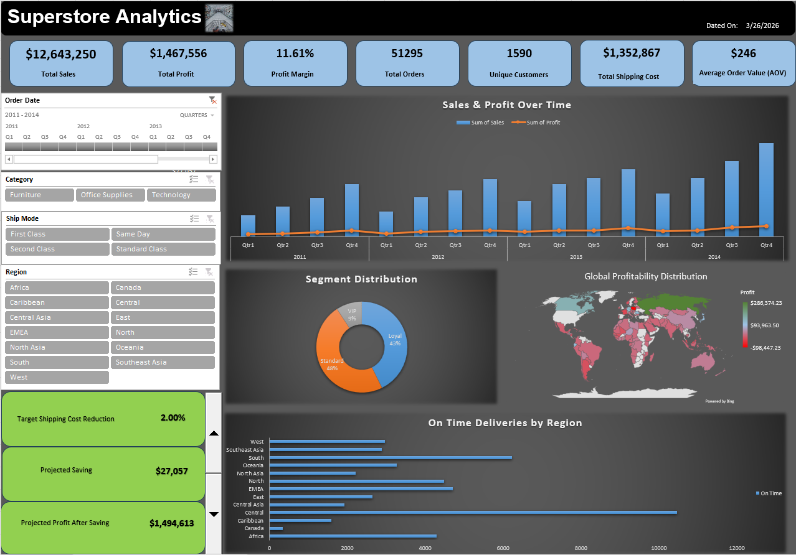

# 📊 SuperStore Global Performance Dashboard

## 🔍 Business Problem
Retail organizations often struggle to balance revenue growth with true profitability. High top-line sales frequently mask underlying margin inefficiencies, particularly regarding global logistics and shipping costs. This project analyzes transactional data to uncover hidden profit drivers, regional performance gaps, and the direct impact of shipping logistics on the bottom line.

## 🎯 Objective
To design a premium, interactive Excel data application that:
* Tracks executive-level business KPIs (Sales, Profit, AOV).
* Simulates real-time profitability scenarios based on shipping cost reductions.
* Highlights geospatial and seasonal profitability challenges.
* Supports data-driven decision-making through an intuitive, app-like interface.

## 🛠️ Tools, Skills & Technologies Demonstrated
* **Core Technologies:**
  * **Power Query:** Automated ETL (Extract, Transform, Load) pipelines for raw data ingestion, cleaning, and transformation.
  * **Power Pivot & Data Model:** Engineered a relational database environment within Excel to handle complex joins and process massive datasets efficiently without file bloat.
  * **Power Pivot Charts:** Built dynamic, high-level visualizations linked directly to the underlying Data Model.
  * **Advanced Microsoft Excel:** Mastered form controls, advanced formatting, and dynamic arrays.
* **Analytical & UX Skills:** Relational Data Modeling, UI/UX Dashboard Design, What-If Scenario Analysis, Data-Ink Ratio Optimization.
* **Key Formulas & Engine Mechanics:**
  * `GETPIVOTDATA` → Dynamic, structured metric extraction for custom KPI cards.
  * `TEXT` → Dynamic date handling and automated subtitle generation.
  * **Custom Number Formatting** → Condensing large figures (e.g., `$#,##0,,"M"`) for cleaner data visualization.
  * **Form Controls & Helper Cells** → Powering the interactive Spin Button math logic.

## ⚙️ Technical Execution

This project goes beyond basic reporting by incorporating:

Structured Data Modeling: Integration of multiple tables (Orders, People, Returns) using Power Pivot relationships
What-If Analysis: Custom scenario logic built using form controls and dynamic calculations
Dashboard Design: Clean layout with consistent formatting, slicers, and interactive filtering

## 📈 Dashboard Highlights
1. **Executive KPI Ribbon:** Tracks Total Sales, Profit, Profit Margin %, Total Orders, Unique Customers, Shipping Costs, and Average Order Value (AOV).
2. **Interactive What-If Engine:** Allows stakeholders to adjust target shipping cost reduction percentages via a UI widget, instantly calculating projected savings and new total profit.
3. **Global Control Panel:** Custom-formatted slicers (Category, Ship Mode, Region) and a dynamic Time slider allow users to filter the entire canvas with a single click.
4. **Deep-Dive Visualizations:** Includes a Sales & Profit Combo Chart, a Geospatial Profit Map, a Customer Segment Donut Chart, and a Regional Shipping Performance Bar Chart.

## 💡 Key Business Insights
* **The Shipping Margin Squeeze:** Total Shipping Costs ($1.35M) run nearly as high as Total Profit ($1.46M). The What-If analysis proves that even a microscopic 1-2% efficiency gain in shipping logistics yields massive improvements to the bottom line.
* **Heavy Q4 Seasonality:** The time-series analysis reveals a steep dependency on end-of-year performance. Both 2013 and 2014 show massive, disproportionate spikes in both Sales and Profit during the fourth quarter.
* **Geospatial Profit Discrepancies:** While top-line revenue is truly global, actual profitability is highly localized. Several international territories are actively operating at a net loss despite generating sales.
* **Customer Retention vs. Acquisition:** The business generated $12.6M in revenue from a concentrated pool of just 1,590 unique customers, indicating a phenomenal repeat-purchase rate but a heavy reliance on a small buyer base.

## 🚀 Business Recommendations
* **Optimize Supply Chain Logistics:** Prioritize renegotiating freight contracts or optimizing delivery routes, as the dashboard proves shipping costs are the primary bottleneck to higher profit margins.
* **Targeted Q4 Resource Allocation:** Scale up inventory and marketing spend strictly leading into Q4 to capitalize on the established seasonal buying frenzy.
* **Re-evaluate Loss-Making Regions:** Implement immediate price increases or restrict high-cost shipping options in the international zones showing negative profit margins on the geospatial map.
* **Expand VIP Programs:** With "Loyal" and "Standard" customers driving 91% of the business, aggressively market the "VIP" tier to diversify the high-value customer base.

## 🔮 Future Enhancements
* **Power Automate Integration:** Configure an automated flow to generate and email PDF snapshots of the dashboard to stakeholders on a weekly basis.
* **Predictive Forecasting:** Incorporate Excel's forecast sheet features to project Q1 2015 revenue based on historical Q4 spikes.
* **Product-Level Drill-Down:** Add a secondary dashboard tab specifically for isolating the exact sub-categories driving the losses in underperforming regions.

## 📌 Conclusion

This project demonstrates the ability to transform raw data into actionable business insights, bridging the gap between Excel-based reporting and strategic decision-making.

It reflects a transition from traditional dashboarding to business-focused analytics and decision support.
